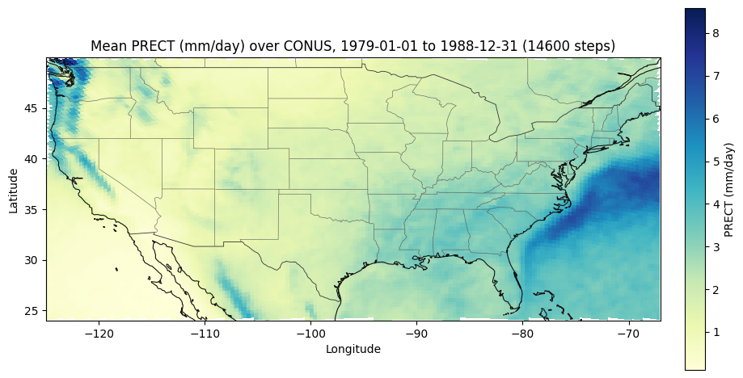

# Using the uxarray MCP server on Casper: a 10-year CONUS precipitation map from 37 GB that never moved

## The prompt

This is the entire input. Typed into an AI assistant on a laptop. No script, no
file list built by hand, no cluster commands, no coordinates.

> I've got a Globus Compute endpoint running on Casper at NCAR — it's called
> `ucar-uxarray-yac`. All the data is on the NCAR filesystem. Nothing is on my
> laptop, and I don't want to download any of it.
>
> Here's what I have:
>
> **Mesh** (CESM ne120 spectral element, about a quarter degree):
> `/glade/p/cesmdata/cseg/inputdata/share/scripgrids/ne120np4_pentagons_100310.nc`
>
> **Data** — 6-hourly PRECT, one file per year, 1979 through 1988, under
> `/gdex/data/d651007/b.e13.BHISTC5.ne120_t12.cesm-ihesp-hires1.0.30-1920-2005.002/atm/proc/tseries/hour_6/`,
> named `...cam.h2.PRECT.1979010100-1980010100.nc` through
> `...cam.h2.PRECT.1988010100-1989010100.nc`.
>
> Can you give me a ten-year average precipitation map over the continental US?
> PRECT comes out in m/s and I'd like it in mm/day. Run everything on Casper —
> don't pull the files over. When you're done, tell me exactly what ran where,
> so I can put it in a methods section.

## The output

```
ELAPSED           462.1 s
n_files           10
n_time_steps      14600
time span         1979-01-01 00:00  →  1988-12-31 18:00
n_face_subset     23510  of 777602   (3.02% of the mesh)
value_stats       min 0.111   mean 2.232   max 8.584 mm/day   n_nonfinite 0
execution_venue   hpc:ucar-uxarray-yac
worker            casper02
provenance.tool   remote_temporal_mean_map
provenance.op_id  op_1676bc621555
```



*Mean PRECT, 1979–1988, CESM ne120 spectral-element mesh, subset to CONUS.
14,600 six-hourly time steps. 23,510 of 777,602 mesh cells. Computed on
casper02 at NSF NCAR. Coastlines, national and state boundaries drawn from
Natural Earth on the worker.*

> **Read the mean correctly.** 2.232 mm/day is the average over the whole
> bounding box, which includes ocean — the deep blue offshore of the Carolinas
> is the Gulf Stream, not land. This is a box average, not a land-masked CONUS
> average.

---

## A worked case study

One paragraph of plain English produced a publication-shaped map from ten years
of 6-hourly CESM output living on the NCAR filesystem — plus a machine-readable
record of exactly which function ran, on which host, under which PBS job, over
how many time steps.

No data was downloaded. The laptop never held more than a 178 KB PNG.

### Contents

- [Why this matters](#why-this-matters)
- [What MCP actually is](#what-mcp-actually-is-in-two-minutes)
- [What the assistant did with the prompt](#what-the-assistant-did-with-the-prompt)
- [Reading the result](#reading-the-result)
- [How it worked under the hood](#how-it-worked-under-the-hood)
- [Why it takes 462 seconds](#why-it-takes-462-seconds)
- [What it cost](#what-it-cost)
- [Set it up yourself](#set-it-up-yourself)
- [Methods: what was used](#methods-what-was-used)
- [Honest limitations](#honest-limitations)

---

## Why this matters

If you work with climate model output at NCAR, the shape of the problem is
familiar. The data is enormous and it lives on GLADE or GDEX. Your analysis code
lives on your laptop. Bridging those two facts costs you an afternoon: ssh in,
remember the module names, remember whether it was `conda activate` or
`module load conda` first, write the loop over annual files, get the longitude
convention wrong once, get the units wrong once, and finally produce a PNG you
then have to `scp` back.

None of that is science. It is logistics.

Three things make this different from "an AI wrote some code for me":

1. **The compute went to the data.** The ~37 GB of 6-hourly output stayed on the
   NCAR filesystem. A small function was shipped *to* Casper, ran there, and
   sent back a picture. This is the opposite of the usual download-then-analyze
   pattern, and it is the only pattern that scales.

2. **Nothing was invented.** The assistant did not write a script and hope. It
   called specific, tested functions in a server that already knows how to open
   an unstructured mesh, subset it, and reduce it. When it tried to pass a
   bounding box to a function that draws the whole globe, the server **refused**
   rather than silently returning a global map.

3. **The answer is auditable.** Every call returned a provenance record. You can
   put `remote_temporal_mean_map`, `casper02`, 14,600 time steps and
   `n_nonfinite: 0` into a methods section and someone else can check it. A
   picture alone cannot tell you what was averaged away. This record can.

That third point is the one worth arguing about. AI assistants are good at
producing plausible plots. The interesting engineering question is how you know
a plot is *right*. The answer here is not "trust the model" — it is that the
model can only call a fixed set of instrumented functions, and each one reports
what it did.

---

## What MCP actually is, in two minutes

**MCP** — Model Context Protocol — is a standard way to give an AI assistant a
set of tools it can call. That is the whole idea.

Without MCP, an assistant that wants to compute something writes code and asks
you to run it. It cannot see your files, does not know your cluster, and has no
way to verify that what it wrote worked. You are the integration layer.

With MCP, you run a small program — a **server** — that publishes a menu of
operations: "inspect this mesh", "compute a zonal mean", "plot this variable".
The assistant reads that menu and calls the operations by name, with arguments.
The server does the actual work and hands back structured results.

```
  You  ──type a question──▶  AI assistant
                                 │
                                 │ calls a named tool with arguments
                                 ▼
                          uxarray MCP server   ◀── runs on your laptop
                                 │
                                 │ ships the work to where the data is
                                 ▼
                          Casper worker at NCAR   ◀── runs uxarray on 37 GB
                                 │
                                 ▼
                          PNG + JSON record  ──────▶  back to you
```

Three consequences worth internalizing:

- **The assistant cannot do anything the server does not offer.** The menu is
  the security boundary and the correctness boundary at once. It cannot delete
  your scratch directory, because deleting files is not on the menu.
- **The server can be tested like any other software.** It has a test suite. The
  functions the assistant calls are the same functions a Python user would call.
- **The results carry their own paperwork.** Because the server — not the model —
  produces the result, the server can attach a provenance record the model
  cannot forge.

The **uxarray MCP server** is one such server. It publishes operations over
unstructured climate meshes (MPAS, CESM spectral-element, SCRIP, UGRID, HEALPix)
and knows how to run them either on your laptop or on an HPC endpoint via
[Globus Compute](https://www.globus.org/compute).

---

## What the assistant did with the prompt

It translated the paragraph into one tool call:

```python
plot_dataset(
    plot_type="temporal_mean",
    grid_path="/glade/p/cesmdata/cseg/inputdata/share/scripgrids/ne120np4_pentagons_100310.nc",
    data_paths=[...ten annual PRECT files...],
    variable_name="PRECT",
    lon_bounds=[-125, -67],           # CONUS
    lat_bounds=[24, 50],
    scale_factor=86400000.0,          # m/s -> mm/day
    units_label="mm/day",
    region_name="CONUS",
    cmap="YlGnBu",
    width=1000, height=560,
    coastlines=True,
    use_remote=True,
    endpoint="ucar-uxarray-yac",
)
```

Three inferences it had to make, none of them stated in the prompt:

| you said | it chose | why that is right |
|---|---|---|
| "continental US" | `lon_bounds=[-125,-67]`, `lat_bounds=[24,50]` | and crucially **negative** longitudes — uxarray normalizes to −180..180, so the naive `[235, 293]` selects nothing at all |
| "m/s, I'd like mm/day" | `scale_factor=86400000.0` | 86,400 s/day × 1000 mm/m |
| "run everything on Casper" | `use_remote=True`, `endpoint="ucar-uxarray-yac"` | the alternative — streaming 37 GB to a laptop — is not a thing that finishes |

---

## Reading the result

### The map

Read it as a scientist would:

- Dry Great Basin and Desert Southwest.
- Wet Pacific Northwest and a clean Sierra Nevada crest.
- Wet Gulf Coast and Southeast, with a visible Appalachian ridge signal.
- Maximum offshore over the Gulf Stream.

That the features register correctly against the drawn coastlines is itself the
test. A longitude-convention bug would have put the Sierra in Kansas.

### The paperwork

Every result carries a `_provenance` block. This is the part you can cite:

```json
"_provenance": {
  "tool": "remote_temporal_mean_map",
  "execution_venue": "hpc:ucar-uxarray-yac",
  "remote_hostname": "casper02",
  "operation_id": "op_1676bc621555",
  "inputs": {"args": ["<grid path>", "[<10 data paths>]", "PRECT", ...]}
}
```

And alongside it, the reduction record — what was averaged away:

```json
"reduced_dims": {"time": {"kind": "time", "how": "mean", "size": 14600}},
"subset_applied": true,
"lon_bounds": [-125.0, -67.0],
"lat_bounds": [24.0, 50.0],
"n_face_total": 777602,
"n_face_subset": 23510,
"value_stats": {"min": 0.111, "mean": 2.232, "max": 8.584, "n_nonfinite": 0}
```

**This is the point of the whole exercise.** A PNG cannot tell you whether it
averaged 14,600 time steps or accidentally took one. It cannot tell you whether
your bounding box selected 23,510 cells or zero. It cannot tell you whether a
level index was silently taken. The JSON says all three, in the same response,
so a wrong plot is *falsifiable* rather than merely pretty.

---

## How it worked under the hood

### The path a request takes

1. **You type a paragraph.** The assistant sees the uxarray server's tool menu
   alongside your text.
2. **The assistant picks one tool and fills in arguments.** Here,
   `plot_dataset` with `plot_type="temporal_mean"`.
3. **The server routes it.** It sees `use_remote=True` and a path starting
   `/gdex/`, matches that against the endpoint's configured `path_prefixes`, and
   picks the Casper endpoint.
4. **The function is serialized and shipped.** Globus Compute's
   `AllCodeStrategies` sends the *source* of the worker function, so the code
   does not have to be pre-installed on Casper.
5. **A Casper worker runs it.** It opens the ten files with
   `ux.open_mfdataset`, subsets to the CONUS bounding box, takes the time mean,
   scales to mm/day, renders a choropleth, and overlays Natural Earth coastlines
   from the worker's cartopy cache.
6. **A PNG and a JSON record come back.** ~180 KB total.

### The one design decision that matters

**The bounding box is applied *before* the reduction.** Subset first, then
average: only 23,510 cells — 3.02% of the mesh — are ever carried through the
mean over 14,600 time steps. Averaging first and cropping after would have done
33× the arithmetic for the same picture.

### Guardrails you can see working

- **Empty selection is an error, not an empty map.** A box that selects zero
  faces raises, and the message names the −180..180 convention, because that is
  the mistake almost everyone makes first.
- **A plot type that cannot honor a box refuses one.** `plot_type="variable"`
  draws the whole mesh. Passing it `lon_bounds` used to silently drop them and
  return a global map. It now raises and names the plot type that *does* honor a
  box. That was a real bug found while building this case study.
- **Remote support is per-operation, not global.** An operation with no remote
  implementation says so explicitly rather than quietly computing on your laptop
  against a path it cannot read.

### Why no cluster redeploy was needed

The worker function for this case study did not exist when the Casper endpoint
was started. It still ran, against an unmodified endpoint, because Globus
Compute ships function source with the task. Iterating on remote analysis code
costs a rerun, not a redeploy. This is a bigger deal than it sounds — it is the
difference between "I'll try a variant" and "I'll file a ticket."

---

## Why it takes 462 seconds

Worth being blunt about, because 7.7 minutes feels slow for what looks like one
average.

**It is I/O bound. The arithmetic is nothing; the reading is everything.**

PRECT is stored as `(time, ncol)` float32. Per year that is
1460 × 777,602 × 4 B = **4.54 GB**. Ten years is **45.4 GB decompressed**, about
37.5 GB on disk. At 462.1 s that is roughly **81 MB/s off disk, 98 MB/s
decompressed** — a single-stream rate.

Three reasons, in order of size:

1. **The CONUS subset saves no reading at all.** You keep 3.02% of cells, but
   those 23,510 indices are scattered through `ncol`, and netCDF chunks are read
   whole. You read essentially all 45 GB to keep 1.4 GB. Subsetting before the
   mean saves memory and arithmetic — not I/O.
2. **One worker, one stream.** The ten annual files are read sequentially. They
   are completely independent, so this is the obvious 5–10× win available.
3. **Workers run on the login node.** The endpoint uses `LocalProvider` (see
   [`docs/ucar.md`](../../docs/ucar.md)). Login-node I/O is shared and throttled;
   compute nodes read faster.

Marginal cost is **~46 s per year of data**, dead linear, which confirms I/O
bound with no meaningful per-call overhead.

**If you need it faster:** compute the ten annual means once and average those —
the repeat becomes seconds. Or parallelize the file reads. Or move the provider
off the login node. The first is cheapest and is what you want if you are going
to look at this field more than once.

---

## What it cost

### Wall clock

Measured against `ucar-uxarray-yac` (casper02) on 2026-09-11:

| what | time |
|---|---|
| capability query (mesh topology, applicable operations) | ~20 s |
| **1 year**, direct call to the compute function | 29.1 s |
| **1 year**, full chain through the MCP server | 51.4 s / 77.5 s (two runs) |
| **10 years**, direct call | 464.4 s |
| **10 years**, full chain through the MCP server | 462.1 s |
| cold-worker penalty if no worker is allocated | add 1–4 min (PBS queue) |

The MCP layer costs approximately nothing: 462.1 s through the full chain versus
464.4 s calling the compute function directly, with identical values to every
printed digit.

### Bytes

| direction | payload |
|---|---|
| laptop → Casper | serialized function + arguments, a few KB |
| Casper → laptop | 177,737-byte PNG + ~3 KB JSON |
| **what never moved** | **~37 GB of 6-hourly CAM output** |

Roughly **200,000:1**. That ratio is the entire argument for moving compute to
data rather than data to compute.

### Tokens

AI assistants are billed per token — roughly per word in and out. Two different
costs are worth separating, because only one of them is interesting.

| item | approximate tokens |
|---|---|
| **standing cost:** the uxarray tool menu, 31 tools, sent on *every* request | **~10,600** |
| the paragraph you typed | ~200 |
| the returned map (1000×560 image) | ~750 |
| the returned metadata + provenance JSON | ~750 |

**The standing cost dominates.** Publishing 31 tools means ~10.6k tokens of
schema ride along with every message, whether or not you use any of them. The
per-call cost of actually doing the science is small by comparison.

Two honest consequences:

- This is a real argument for the server's "front door" design — `run_analysis`
  and `plot_dataset` cover most of the surface, and a narrower registered tool
  list would cut the standing cost several-fold.
- Turn the server off in sessions not doing mesh analysis. Most MCP clients let
  you enable servers per session.

A ten-year analysis like this one is a few cents of tokens against several
minutes of a Casper worker. The token bill is not the thing to optimize; the
schema footprint is.

---

## Set it up yourself

Two halves: something on your laptop, something on Casper. **Do the laptop half
first** — it works entirely on its own with local files, and you should confirm
it before adding a cluster to the picture.

### Part 1 — your laptop (about 10 minutes)

**Step 1. Install.**

```bash
uv tool install --python 3.12 uxarray-mcp
```

If you don't have `uv`, install it first from
<https://docs.astral.sh/uv/getting-started/installation/>. It downloads Python
3.12 for you.

> **Why exactly 3.12?** Only the HPC half needs it. Globus Compute's serializer
> is fragile across Python minor versions. Laptop-only use works on 3.11–3.13.

**Step 2. Write a starter config.**

```bash
uxarray-mcp setup
```

Creates `~/.config/uxarray-mcp/config.yaml`. Local-only use needs nothing more.

**Step 3. Connect your AI assistant.**

Claude Code:

```bash
claude mcp add uxarray --transport stdio -- uxarray-mcp serve
```

Claude Desktop:

```bash
uxarray-mcp install-claude --config-path ~/Library/Application\ Support/Claude/claude_desktop_config.json
```

Then restart the app. Other MCP clients: `uxarray-mcp install-claude --print-only`
prints the JSON block most of them accept.

**Step 4. Check it.** Ask your assistant, in plain English, to inspect a mesh
file you already have locally. If it comes back with a face and node count, the
laptop half works.

### Part 2 — a Casper endpoint (about 30 minutes, once)

Full detail is in [`docs/ucar.md`](../../docs/ucar.md). The short version:

**Step 1. Build a worker environment on Casper.** One time.

```bash
ssh <username>@casper.ucar.edu
module load conda
conda create -p /glade/work/$USER/conda-envs/uxarray_dev python=3.12 -c conda-forge -y
conda activate /glade/work/$USER/conda-envs/uxarray_dev
pip install globus-compute-endpoint uxarray xarray netCDF4 h5netcdf matplotlib cartopy
```

Worker Python **must** be 3.12. Include `cartopy` if you want coastlines drawn
on your maps, as in the figure above.

**Step 2. Configure and start the endpoint.**

```bash
git clone https://github.com/UXARRAY/uxarray-mcp-server.git
cd uxarray-mcp-server
export CONDA_ENV=uxarray_dev MODULES="ncarenv/24.12 conda"
./scripts/endpoint.sh install
./scripts/endpoint.sh configure
./scripts/endpoint.sh start
```

The first start opens an OAuth flow: paste the printed URL into a browser on
your laptop, paste the code back. It then prints a UUID. **Copy that UUID.**

You need the repo cloned on Casper because the scripts live in it. You do *not*
need `uxarray_mcp` importable on the worker — remote functions are sent as
source.

**Step 3. Register the endpoint on your laptop.**

```bash
uxarray-mcp endpoints add ucar-casper <uuid> --path-prefix /glade/ --path-prefix /gdex/
```

**Register every path prefix you will read from.** This is the step people skip
and then spend an hour debugging. Without `/gdex/`, a request naming a GDEX file
matches no endpoint, falls through to whatever your default endpoint is —
possibly a cluster at another facility that cannot see the file at all.

**Step 4. Raise the timeout if you run multi-year jobs.** In
`~/.config/uxarray-mcp/config.yaml`:

```yaml
    ucar-casper:
      endpoint_id: <uuid>
      path_prefixes: [/glade/, /gdex/]
      timeout_seconds: 2400      # the default 300 is too short for a 10-year mean
```

The ten-year run here takes 462 s. At the default 300 s the call raises a
timeout *after* the worker has already been doing the work.

**Step 5. Verify.** Ask your assistant to check the endpoint status with a
worker probe. You want `status: active` and a node name. `registered` means the
manager is up but no worker is allocated — the next real call will wait in the
PBS queue.

### Then ask it something

Paste the paragraph from [The prompt](#the-prompt), with your own endpoint name
and file paths. Start with one year before you ask for ten.

---

## Methods: what was used

Everything needed to reproduce or check the run above.

**Software**

| component | version / detail |
|---|---|
| uxarray MCP server | v2026.9.0 |
| submitter Python | 3.12.10 (laptop) |
| worker Python | 3.11.12 (Casper conda env) |
| serialization | Globus Compute `AllCodeStrategies`, Dill 0.3.9 both ends |
| geography | cartopy 0.24.1 on the worker, Natural Earth cached locally there |

The submitter/worker Python minor-version skew emits a warning
(`Environment differences detected...`) and worked in every run here. The
submitter must be 3.12; tracked at
[globus/globus-compute#2139](https://github.com/globus/globus-compute/issues/2139).

**The call chain**

```
plot_dataset(plot_type="temporal_mean", ...)         # tools/frontdoor.py
  └─ temporal_mean_map(...)                          # tools/remote_tools.py
       └─ agent.temporal_mean_map_remote(...)        # remote/agent.py
            └─ remote_temporal_mean_map(...)         # remote/compute_functions.py
                                                     #   ↑ runs on casper02
```

`remote_temporal_mean_map` was written for this case study. On the worker it
calls `ux.open_mfdataset`, `Grid.subset.bounding_box`, an `xarray` time mean,
and HoloViews `polygons()` on the matplotlib backend, then draws Natural Earth
geometries as a `LineCollection` in plain degrees.

**Endpoint configuration as run**

```yaml
    ucar-uxarray-yac:
      endpoint_id: <uuid>
      path_prefixes: [/glade/, /gdex/]
      timeout_seconds: 2400
```

**Two bugs found and fixed while producing this**

- `plot_dataset(plot_type="variable")` accepted `lon_bounds`/`lat_bounds` and
  silently ignored them, returning a global map with nothing in the response
  saying the box had been dropped. It now raises and names the plot type that
  honors a box.
- The endpoint's `path_prefixes` listed only `/glade/`. GDEX paths start
  `/gdex/`, matched no prefix, and routed to the configured default endpoint —
  a cluster at a different facility that cannot see the files. Both prefixes are
  now registered.

**Measured versus estimated**

Wall-clock times, byte counts, cell counts and all `value_stats` are measured
from the runs described. Token counts are estimates: the tool-schema figure is
measured from the registered tool list; image and JSON token figures are
standard approximations, not billing records.

---

## Honest limitations

Things a demo usually hides. They are here because a case study that only shows
the happy path is not evidence of anything.

- **Ten years takes 7.7 minutes.** That is real work on real data and there is
  no trick that makes it instant. Plan for it; run one year first.
- **The mean is over a box, not over land.** 2.232 mm/day includes the offshore
  Atlantic and Pacific inside the bounding box. A land-masked CONUS average is a
  different number.
- **The endpoint has to be up.** If the manager is down, nothing works, and the
  error says so. `globus-compute-endpoint start <name>` on Casper.
- **Cold start hurts.** The first call after an idle period waits in the PBS
  queue. Warm the worker before you need a fast answer.
- **Remote support is per-operation.** Not every operation in the server has a
  remote implementation yet. Ones that don't say so explicitly instead of
  quietly running locally against a path they cannot read — but you may still
  hit "this one runs locally only."
- **The ensemble member.** This case study uses member `.002`. The originating
  request named member #10; only `.002` and `.003` are staged in the 6-hourly
  tier of `d651007`. Which member you get is a property of what is on disk, not
  of the tooling — and the provenance record is what makes that checkable rather
  than assumed.
- **The assistant can still be wrong about what you meant.** It inferred a CONUS
  bounding box you did not specify. That inference was right, and it is recorded
  in the provenance so you can check it. Read the provenance. That is what it is
  for.

---

## Reference

- Dataset: UCAR GDEX `d651007` (MESACLIP), CESM iHESP high-resolution historical
- Mesh: `ne120np4_pentagons_100310.nc` — CESM ne120 spectral element, SCRIP
  format. The grid file presents GLL nodes as face centers, a quirk of how SE
  grids are written to SCRIP; uxarray reads 777,602 "faces" and everything
  downstream stays consistent.
- Variable: `PRECT`, total precipitation rate, m/s
- Docs: [`docs/ucar.md`](../../docs/ucar.md) ·
  [`docs/remote-hpc.md`](../../docs/remote-hpc.md) ·
  [`docs/provenance.md`](../../docs/provenance.md) ·
  [`docs/operating-an-endpoint.md`](../../docs/operating-an-endpoint.md)
